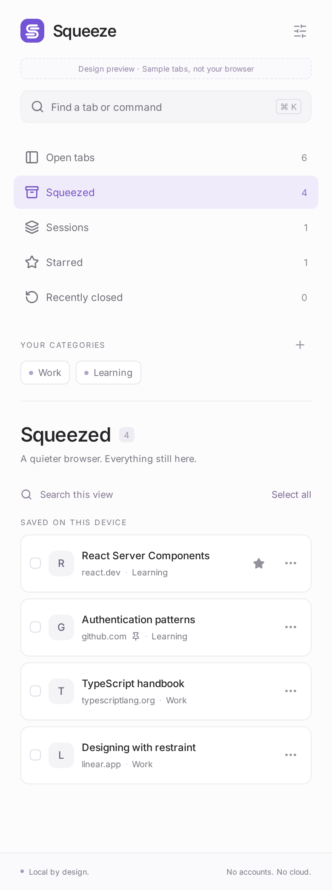
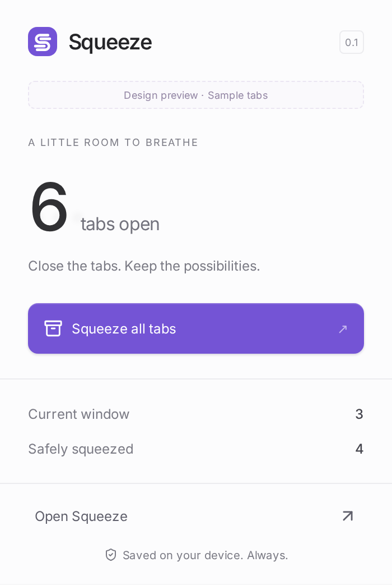

# Squeeze

**Close the tabs. Keep the possibilities.**

Squeeze is a local-first Chrome tab-parking extension. Save before closing. Return when you need it. No AI, accounts, servers, analytics, or content scraping.

## Run
Requires Node.js 22 and desktop Chrome 116+.

```sh
npm ci
npm test
npm run build
```

Open `chrome://extensions`, enable **Developer mode**, choose **Load unpacked**, and select `dist/`.

Click the toolbar icon, then **Open Squeeze** for the Side Panel. Use ordinary test tabs first. URLs and titles are saved, not unsaved forms, page history, authentication state, or scroll positions.

## Included
- Tab discovery, selection, single/bulk/current-window/group parking.
- Durable local save and read-back before closing. Changed tabs are left open.
- Reopen saved tabs without removing the saved copy; pinned state and group metadata.
- Categories, sessions, stars, local search, recently squeezed list.
- Best-effort recently closed record for observed regular web tabs (latest 100).
- Side Panel, compact popup, command palette, keyboard shortcuts, context menu.
- Delete saved records with undo in the current panel session.

Only `http:` and `https:` tabs are supported for parking. Incognito and internal browser tabs stay open. Tab groups are restored where Chrome supports them. Reopening to the original window is not implemented yet.

## Keyboard
- Ctrl / Cmd + K: command palette inside the panel.
- Alt + Shift + S: squeeze current tab.
- Alt + Shift + O: open panel.
- Customize Chrome shortcuts at `chrome://extensions/shortcuts`.

## Verification
```sh
npx playwright install chromium
node scripts/verify-ui.mjs
node scripts/verify-extension.mjs
```

UI previews use labeled sample data. `npm run dev` does **not** control live browser tabs.

Real Chrome integration covers worker loading, tab discovery, save/close, reopen, and persistence across full browser restart. Unit tests cover persistence failure, read-back failure, URL navigation race, partial failures, concurrent requests, safe schemes, pin/order/group restoration, and local search.




## Spec-driven workflow
Initialized with GitHub Spec Kit `specify-cli` 1.0.13. The constitution, prioritized specification, plan, research, data model, contracts, tasks, and convergence notes are versioned. See [the plan](specs/001-tab-parking/plan.md) and [remaining work](specs/001-tab-parking/convergence.md).

## Privacy
Data stays in `chrome.storage.local` and a temporary observed-tab cache in `chrome.storage.session`. No browsing data is sent to a server. Permissions are limited to tabs, tab groups, local storage, side panel, and context menus. No host permissions or content scripts are requested.

Uninstalling Squeeze removes its local extension data. Export/backup is not implemented in this initial build, so do not uninstall while parked tabs are your only copy.

## Scope
This is an initial testable build, not a Chrome Web Store release. Full onboarding, backup/import/export, advanced window restoration, favicon rendering, hover previews, list grouping by date/domain, and complete accessibility audits remain follow-up work.
