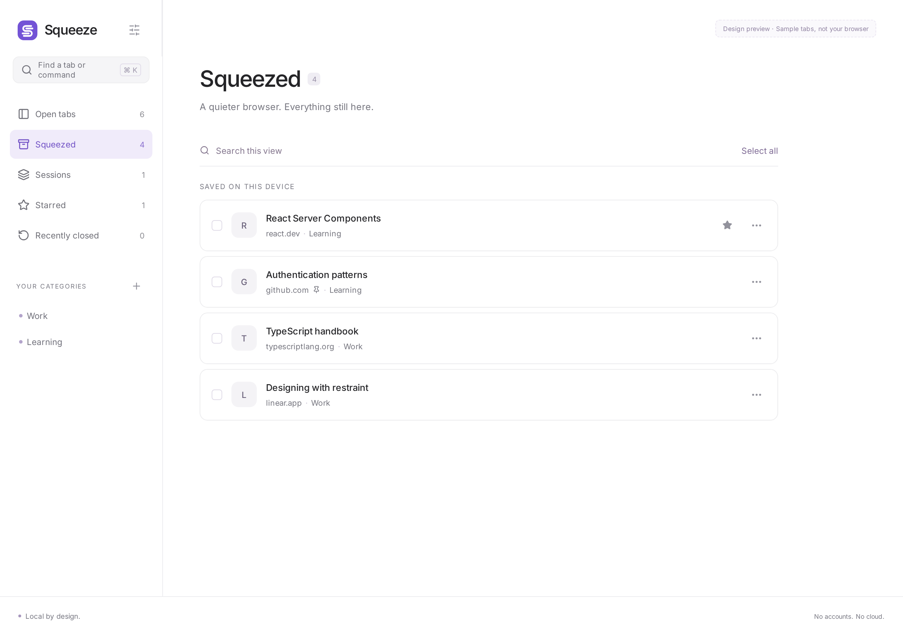

# feat: ship local-first Squeeze tab parking MVP

## Summary
A polished MV3 Chrome extension for closing tabs without losing them. Save, verify, then close. The full app tab is the main surface, with an optional Side Panel; a compact popup is the entry point.

## Changes
- Actual GitHub Spec Kit scaffold, constitution, spec, research, plan, contracts and tasks.
- Serialized local state engine, persistence read-back, URL race check, safe URL handling.
- Single/multiple/current-window/group parking, reopen ordering, pinned state, Chrome groups.
- Categories, sessions, stars, text search, delete/undo, best-effort recent-close records.
- Full app tab, optional Side Panel, quick-action popup, command palette, shortcuts and minimal context menu.
- CI, test scripts, local-only privacy documentation and honest follow-up list.

## Verification
- 12 unit tests pass.
- Strict TypeScript and production build pass.
- Real Chromium extension loads; saves/closes/reopens two web tabs; data survives browser restart.
- UI checks pass: selection/squeeze, popup, palette, 360px no horizontal overflow.
- Search test: three 1,000-record queries in 11ms on test machine.
- Actual rendered pixels inspected; secondary text contrast improved and renders rechecked.

## Screenshots
These two renders use **labeled sample data**, not user browsing history.

## Limits
No Chrome Web Store publishing. No AI/server/account/analytics. Unsaved form content and scroll position are not preserved. P3 features and wider real-Chrome interaction tests remain open. See convergence report for full gaps.

---

<strong>Squeeze</strong> Less clutter. Nothing lost. Local by design · Save before close · No AI

